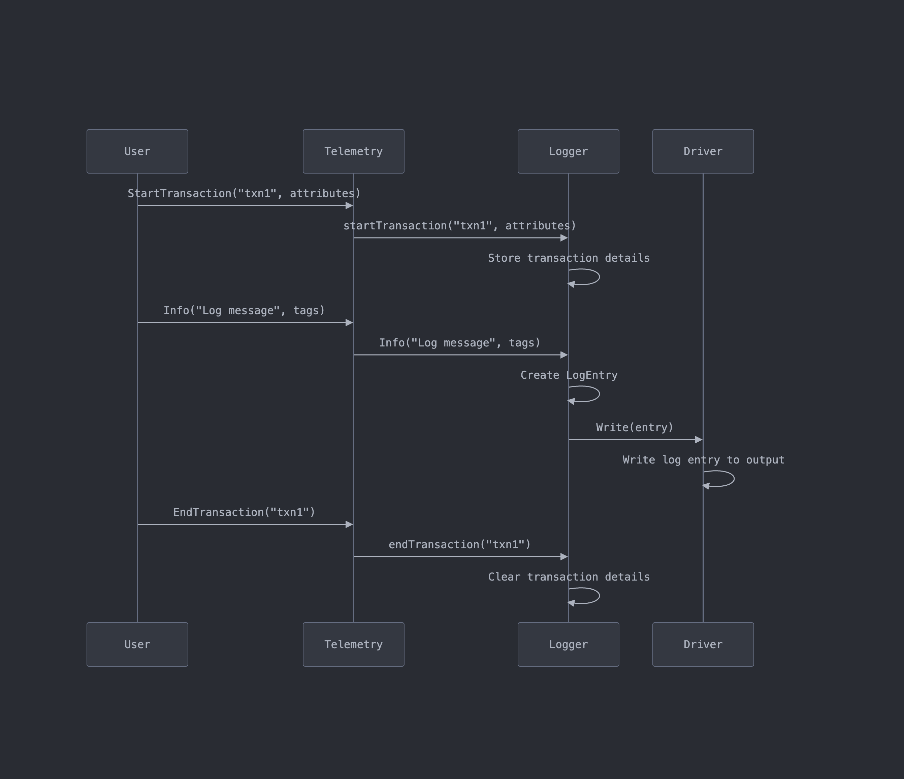

# Go Telemetry Package

## Overview

This Go Telemetry Package provides a flexible and extensible logging solution for Go applications. It supports multiple output drivers, runtime configuration, and transaction-styled logs.

## Features

- Multiple log levels (Debug, Info, Warning, Error)
- Support for multiple output drivers (CLI, JSON file, Text file)
- Runtime addition and removal of drivers
- Transaction-styled logs
- Configurable via YAML file
- Thread-safe operations

## Installation

To install the telemetry package, use the following command:

```bash
go get github.com/ioneldev/telemetry
go get github.com/ioneldev/telemetry/drivers
```

## Usage

### Basic Setup

```go
package main

import (
    "github.com/ioneldev/telemetry"
    "github.com/ioneldev/telemetry/drivers"
)

func main() {
    // Initialize telemetry with basic config
    t, err := telemetry.New("/path/to/config.yaml")
    if err != nil {
        // Handle error
    }

    // Add drivers at runtime
    t.AddDriver(&drivers.CLIDriver{})
    t.AddDriver(drivers.NewJSONFileDriver("/path/to/logs.json"))

    // Use telemetry
    t.Info("This is a log message", map[string]string{"key": "value"})
}```

### Configuration File

Create a `config.yaml` file:

Log levels:
- 0: Debug
- 1: Info
- 2: Warning
- 3: Error

```yaml
defaultLogLevel: 1
```

### Adding and Removing Drivers

```go
// Add a driver
t.AddDriver(drivers.NewTextDriver("/path/to/logs.txt"))

// Remove a driver
jsonDriver := drivers.NewJSONriver("/path/to/logs.json")
t.RemoveDriver(jsonDriver)
```

### Using Transactions

```go
t.StartTransaction("transaction1", map[string]string{"user": "john"})
t.Info("Processing order", map[string]string{"orderID": "12345"})
// ... more logs
t.EndTransaction("transaction1")
```

## Diagrams

This section presents diagrams that illustrate the architecture and flow of the Go Telemetry Package.


*Class Diagram*


*Component Diagram*


*Sequence Diagram*

## Extending the Package

### Creating a Custom Driver

To create a custom driver, implement the `Driver` interface:

```go
type Driver interface {
    Write(entry LogEntry)
}
```

Example:

```go
type CustomDriver struct {
    // Your custom fields
}

func (d *CustomDriver) Write(entry LogEntry) {
    // Your custom logging logic
}
```

Then, you can add your custom driver at runtime:

```go
customDriver := &CustomDriver{}
t.AddDriver(customDriver)
```

## Contributing

Contributions are welcome! Please feel free to submit a Pull Request.

## License

This project is licensed under the MIT License - see the [LICENSE](LICENSE) file for details.
